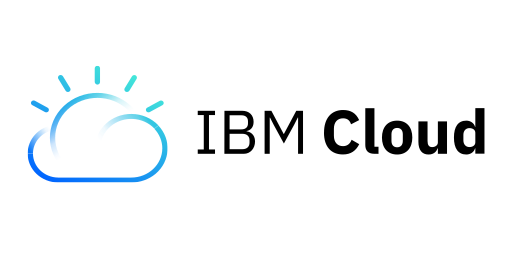

# Bienvenido :wave: Soy Jose Uriel Rodriguez Ramirez 

## :sparkler: Que hago ahora...

Actualmente me encuentro estudiando la Ing. en Gestion y Desarrollo de Software y trabajando en proyectos de manera independiente y tambien en algunas praticas profesionales.
 ***

## :clock1: Mi ruta de aprendizaje
* Como ruta de aprendizaje me encuentro manejando algunas tecnologias como lo son:

    -  HTML 
    -  CSS
    -  JavaScript
    -  PHP   
    - Java
    -  Dart
    -  Python

    
 ***
## 🗒️ Siempre hay algo nuevo por aprender
* Tambien estoy trabajando en algunos nuevos lenguajes y tecnologias, nunca se deja de aprender algo nuevo.

    <!-- - - C# -->
    - C++
    - C
   <!-- - Bash-->

* Son tecnologias con las cuales he realizado algunos proyectos como los que puedes ver en mis repositorios :telescope:.

*   Algunos Frameworks y librerias con los que ya he trabajado son las siguientes:

    - Bootstrap
    - Django
    - Laravel
    - CodeIgniter

***

## ☁️ Un poco de la Nube
* Por ultimo actualmente me encuentro probando tecnologias en la nube como lo son:

    - 
    - 

* Las cuales por cierto puedes experimentar de forma gratuita :wink:
## :open_hands: ! Contactame ¡
Puedes contactarme en cualquier medio :smile: 

Mis Redes Sociales 
  <b></b> 
   &nbsp
  &nbsp
  
    

***

### Sin mas eres libre de explorar el perfil. Espero te guste, cualquier duda o comentario puedes hacerlo en mis redes sociales :grin:

<!--
**Jose-beat/Jose-beat** is a ✨ _special_ ✨ repository because its `README.md` (this file) appears on your GitHub profile.

Here are some ideas to get you started:

- 🔭 I’m currently working on ...
- 🌱 I’m currently learning ...
- 👯 I’m looking to collaborate on ...
- 🤔 I’m looking for help with ...
- 💬 Ask me about ...
- 📫 How to reach me: ...
- 😄 Pronouns: ...
- ⚡ Fun fact: ...
-->
